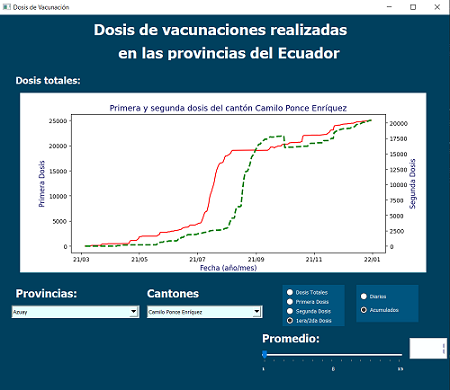

# Proyecto Final - PYTHON INTERMEDIO

## Objetivos de aprendizaje
- Aplicar nuevas habilidades a un problema del mundo real
- Sintetizar las técnicas aprendidas

## Herramientas

- git
- github (utilizar gitignore para proyectos python)
- python 3 
- librerías (pandas, matplotlib, numpy, sympy, datetime, PyQt5, sys)
- pyqt5 
- QT Designer

## Organización de carpetas

```
├── .github                     # Archivo generado por el github
├── data                        # Datos
│   └── vacunasCantones.csv     # Datos de vacunas
├── gui                         # Archivos de GUI
│   └── interfaz.ui             # Diseño de ventana principal
├── notebook                    # Archivos jupyter
│   └── preprocesamiento.ipynb  # Definición de gráficas
├── main.py                     # Archivo principal
├── mplwidget.py                # Archivo para interfaz.ui
├── requirements.txt            # Archivo con dependencias
└── __pycache__                 # Cache
```

## Descripción

Este proyecto permite apreciar de manera gráfica datos reales sobre vacunas realizadas en los cantones de cada provincia
del Ecuador. Cuando el usuario seleccione la provincia y cantón específico puede graficar la información dependiendo de los 
datos de vacunas que desee visualizar, los cuales son (dosis total, primera dosis, segunda dosis, primera/segunda dosis),
de esta manera puede apreciar de mejor manera la información. Así mismo, puede optar por las opciones de graficar los datos
de manera acumulada o diaria.

A continuación se muestra la ventana principal de la aplicación. 


<div align="center">
<a href="https://www.youtube.com/watch?v=-gU4AD_nDhM" target="_blank">

</a>
<p>Demostración de funcionamiento</p>
</div>

<br/><br/>


## Versiones y evoluciones del producto

Versión 1.1.0 - 27 de diciembre 2021 

- Selección de fuente de datos
- Lectura de datos
- Visualización de gráficas

Versión 2.1.0 - 7 de enero 2022

- Desarrollo de método para widget 1 (graficas)
- Desarrollo de método para widget 2 (obtención de data para la lista principal) 
- Desarrollo de método para widget 3 (obtención de data para la lista secundaria)
- Diseño de prototipo en QT Designer

Versión 3.1.0 - 21 de enero 2022

- Implementación de widget 1 (graficas)
- Implementación de widget 2 (obtención de data para la lista principal) 
- Implementación de widget 3 (obtención de data para la lista secundaria)
- Implementación de widget 4 (slider para seleccionar el número de días utilizados para calcular el promedio móvil de los datos)

Versión 3.2.0 - 2 de febrero 2022

- Implementación de widget 5 (widget para seleccionar qué trazar, ejemplo casos, muertes o ambos)
- Implementación de widget 6 (widget para seleccionar si se trazan datos acumulados o diarios)
- Pruebas de aplicación 
- Vídeo demostrativo de aplicación (youtube)
- Actualización README.md
